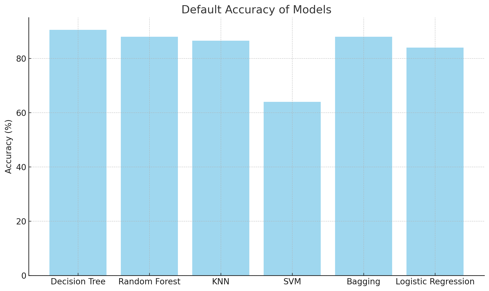
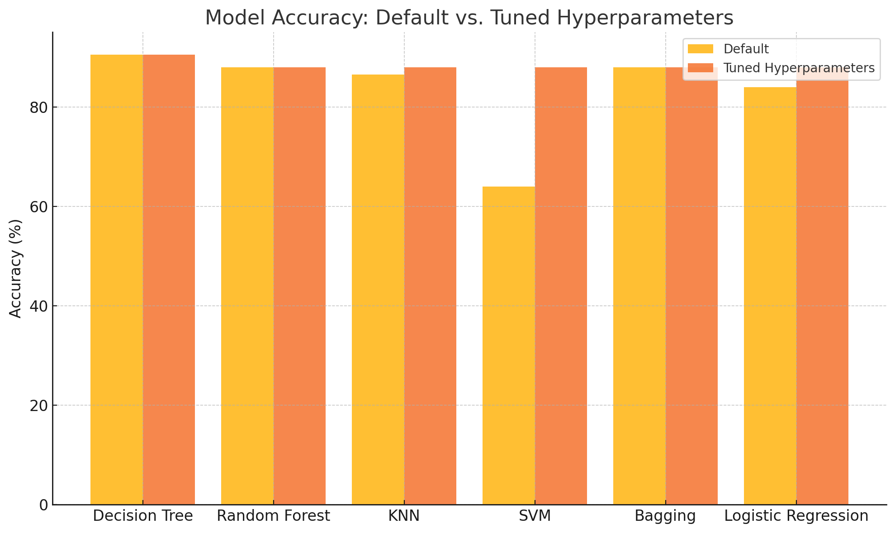

# Sleep Disorder Prediction System

This project focuses on predicting sleep disorders using various machine learning models. The system analyzes input data to classify potential sleep disorders, providing a cost-effective and efficient alternative to traditional diagnostic methods.

---

## Table of Contents
- [Introduction](#introduction)
- [Motivation](#motivation)
- [Dataset](#dataset)
- [Models and Techniques](#models-and-techniques)
- [Results](#results)
- [Graphs](#graphs)
- [Installation](#installation)
- [Usage](#usage)
- [Future Scope](#future-scope)
- [License](#license)

---

## Introduction
Sleep is vital for maintaining health and well-being. Disruptions to normal sleep patterns, caused by conditions such as insomnia, sleep apnea, and restless leg syndrome, can negatively impact physical and mental health. This project aims to create a machine learning-based system for the early detection of sleep disorders.

---

## Motivation
Diagnosing sleep disorders often requires expensive and time-consuming tests like polysomnography. This project seeks to provide a more accessible solution by leveraging machine learning models to predict sleep disorders accurately and efficiently.

---

## Dataset
The **[Sleep Health and Lifestyle Dataset](https://www.kaggle.com/datasets)** from Kaggle is used in this project. The dataset contains information about sleep habits, lifestyle factors, and health indicators.

---

## Models and Techniques
The following machine learning models were implemented and evaluated:
1. **Decision Tree**
2. **Random Forest**
3. **K-Nearest Neighbors (KNN)**
4. **Support Vector Machine (SVM)**
5. **Bagging Classifier**
6. **Logistic Regression**

Each model was trained and tuned using hyperparameter optimization techniques to achieve the best performance.

---

## Results
- **Best Model:** Decision Tree
  - Accuracy: 90.6%
  - Precision: 87.5%
  - Recall: 85.4%
  - F1 Score: 86.3%
  
Other models like Random Forest, SVM, and Logistic Regression also achieved competitive accuracy (88%) after hyperparameter tuning.

---

## Graphs
### Model Accuracy: Default vs. Tuned Hyperparameters


### Default Accuracy of Models


---

## Installation
1. Clone this repository:
   ```bash
   git clone https://github.com/yourusername/sleep-disorder-prediction.git
   cd sleep-disorder-prediction
